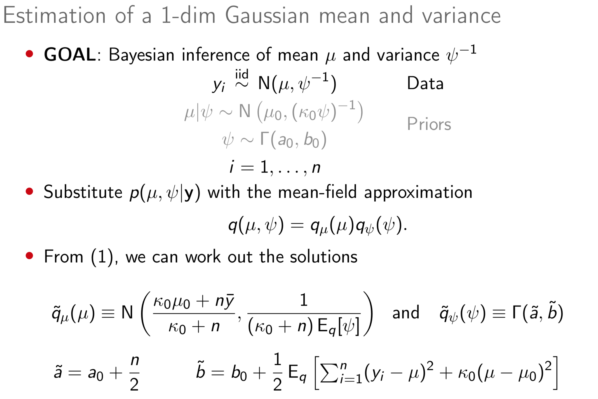
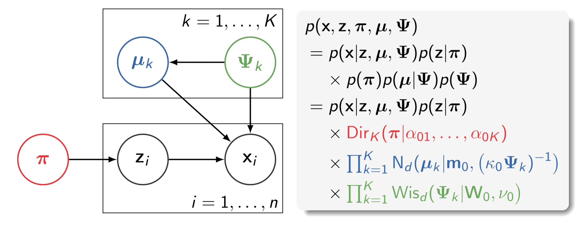
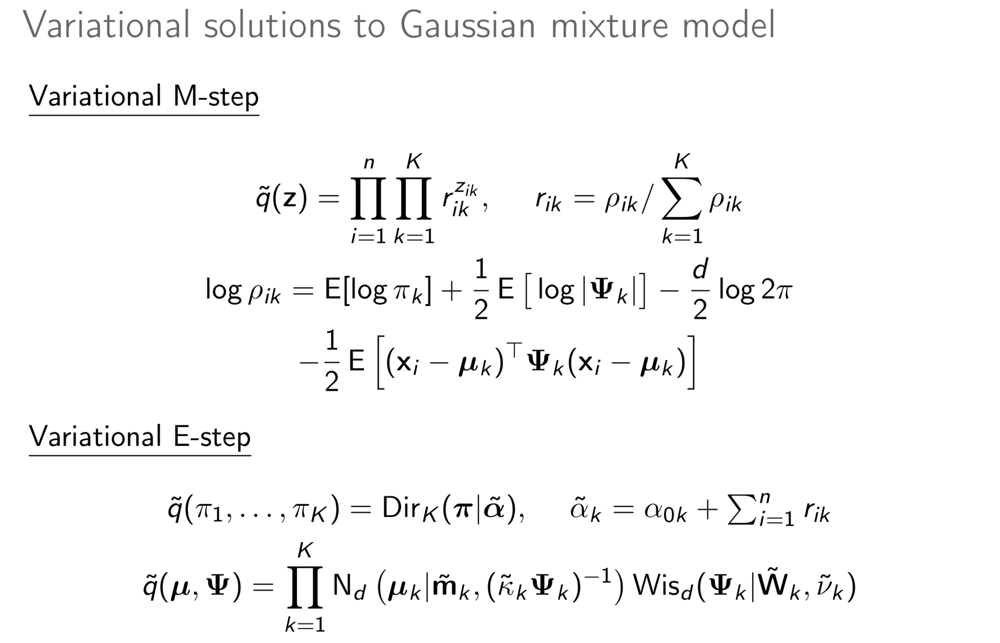
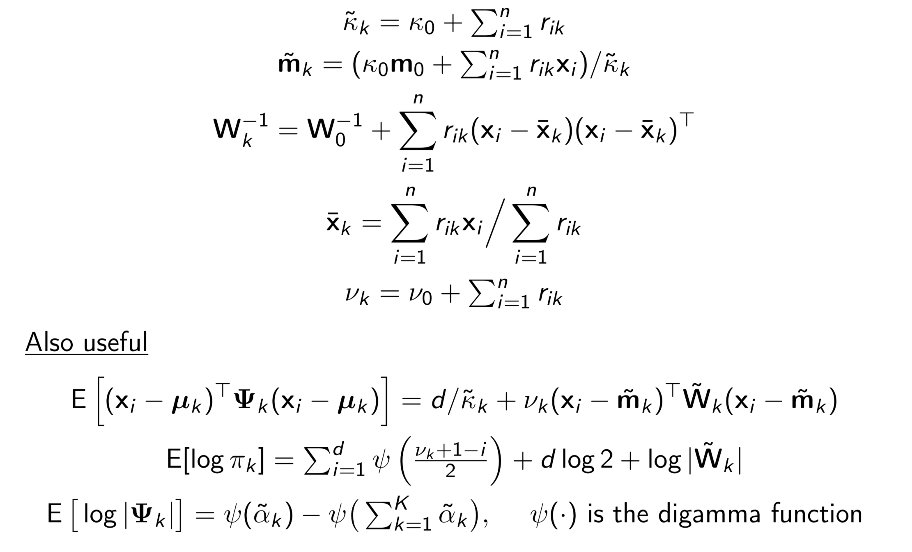
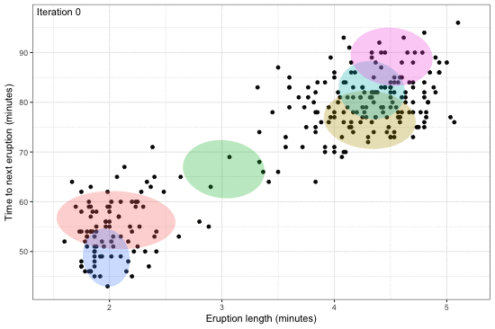
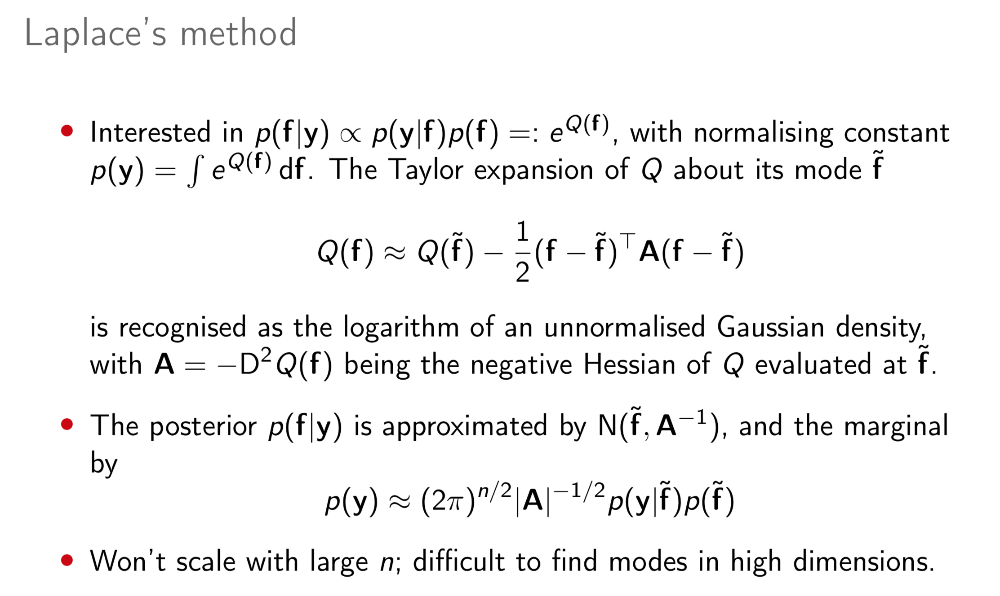
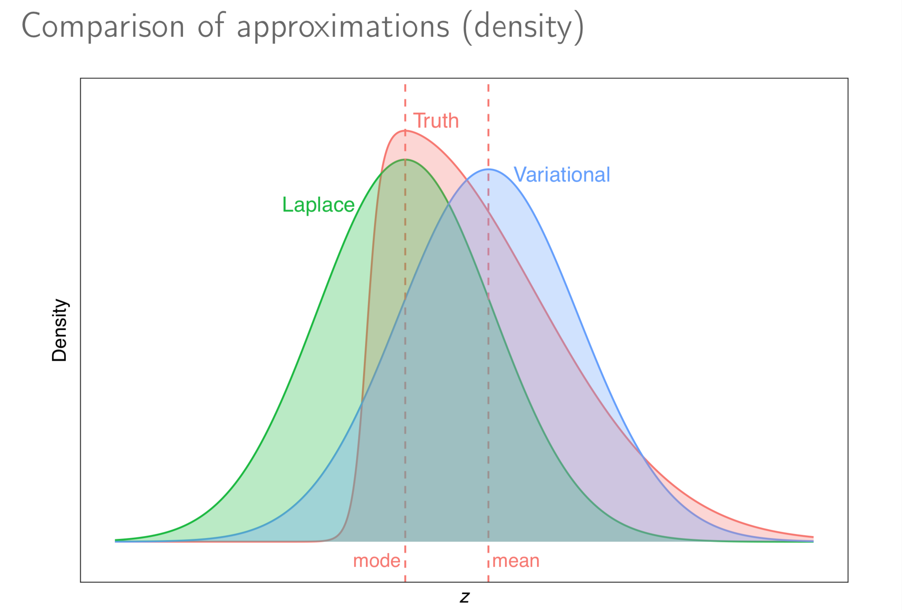
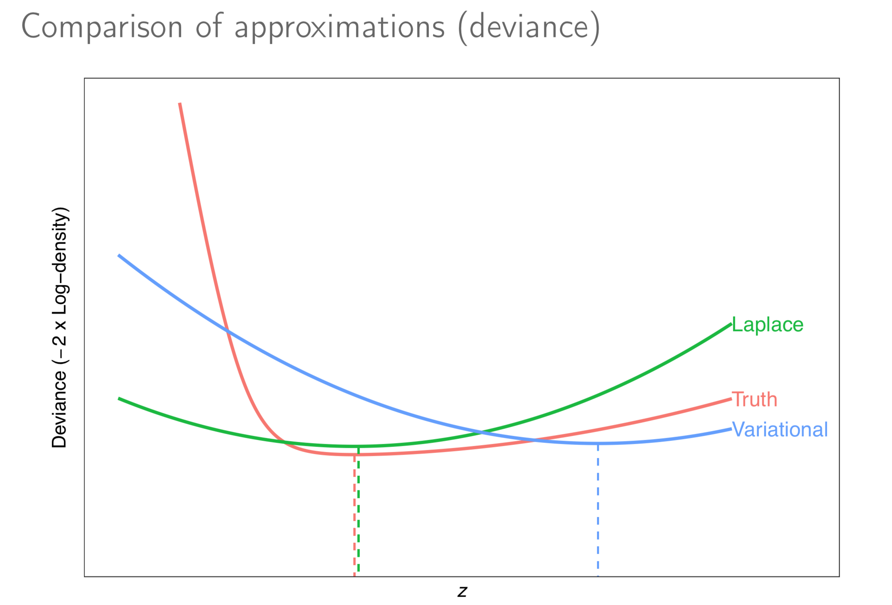

Abstract
--------

<!-- This talk aims to introduce the concept of variational techniques for estimating statistical models with latent variables.  -->
Estimation of complex models that consists of latent variables and various parameters, in addition to the data that is observed, might involve overcoming an intractable integral. For instance, calculating the likelihood of such models require marginalising over the latent variables, and this may prove to be difficult computationally---either due to model design or dimensionality. Variational inference, or variational Bayes as it is also known, offers an efficient alternative to Markov chain Monte Carlo methods, the Laplace approximation, and quadrature methods. Rooted in Bayesian inference and popularised in machine learning, the main idea is to overcome the difficulties faced by working with "easy" density functions in lieu of the true posterior distribution. The approximating density function is chosen so as to minimise the (reverse) Kullback-Leilber divergence between them. The topics that will be discussed are mean-field distributions, the coordinate ascent algorithm, and its properties, with examples following. The hope is that the audience will gain a basic understanding of the method to possibly spur on further research and applications in their respective work.

*Keywords*: `variational`, `Bayes`, `inference`, `expectation`, `maximisation`, `EM`, `propagation`, `EP`, `algorithm`, `coordinate`, `ascent`, `Gaussian`, `mixture`, `approximation`, `intractable`, `Kullback-Leibler`, `Markov`, `chain`, `Monte`, `Carlo`, `MCMC`

Supplementary material
----------------------

### Variational inference for Gaussian mean and precision

### Variational inference for mixture of Gaussians

 

### Comparison to Laplace's method

  

References
----------

-   Beal, M. J. and Z. Ghahramani (2003). “The variational Bayesian EM algorithm for incomplete data: With application to scoring graphical model structures”. In: Bayesian Statistics 7. Proceedings of the Seventh Valencia International Meeting. Ed. by J. M. Bernardo, A. P. Dawid, J. O. Berger, M. West, D. Heckerman, M. Bayarri, and A. F. Smith. Oxford: Oxford University Press, pp. 453–464. ISBN: [978-0-198-52615-5](https://global.oup.com/academic/product/bayesian-statistics-7-9780198526155).

-   Bishop, C. M. (2006). *Pattern Recognition and Machine Learning*. Springer. ISBN: [978-0-387-31073-2](http://www.springer.com/gb/book/9780387310732).

-   Blei, D. M. (2017). “Variational Inference: Foundations and Innovations”. [URL](https://simons.berkeley.edu/talks/david-blei-2017-5-1).

-   Blei, D. M., Kucukelbir, A., & McAuliffe, J. D. (2017). “Variational Inference: A Review for Statisticians”. *Journal of the American Statistical Association*, to appear. arXiv: [1601.00670](https://arxiv.org/abs/1601.00670).

-   Erosheva, E. A., S. E. Fienberg, and C. Joutard (2007). “Describing disability through individual-level mixture models for multivariate binary data”. *Annals of Applied Statistics*, 1.2, p. 346.

-   Grimmer, J. (2010). “An introduction to Bayesian inference via variational approximations”. *Political Analysis* 19.1, pp. 32–47. DOI: [10.1017/pan.2017.28](https://doi.org/10.1017/pan.2017.28).

-   Gunawardana, A. and W. Byrne (2005). “Convergence theorems for generalized alternating minimization procedures”. *Journal of Machine Learning Research* 6, pp. 2049–2073.

-   Kass, R. and A. Raftery (1995). “Bayes Factors”. *Journal of the American Statistical Association* 90.430, pp. 773–795. DOI: [10.2307/2291091](https://doi.org/10.2307/2291091).

-   Murphy, K. P. (2012). *Machine Learning: A Probabilistic Perspective*. The MIT Press. ISBN: [978-0-262-01802-9](https://mitpress.mit.edu/books/machine-learning-0).

-   Wang, Y. S., R. Matsueda, and E. A. Erosheva (2017). “A variational EM method for mixed membership models with multivariate rank data: An analysis of public policy preferences”. arXiv: [1512.08731](https://arxiv.org/abs/1512.08731).

-   Zhao, H. and P. Marriott (2013). “Diagnostics for variational Bayes approximations”. arXiv: [1309.5117](https://arxiv.org/abs/1309.5117).

------------------------------------------------------------------------

Copyright (C) 2018 [Haziq Jamil](http://haziqj.ml).
